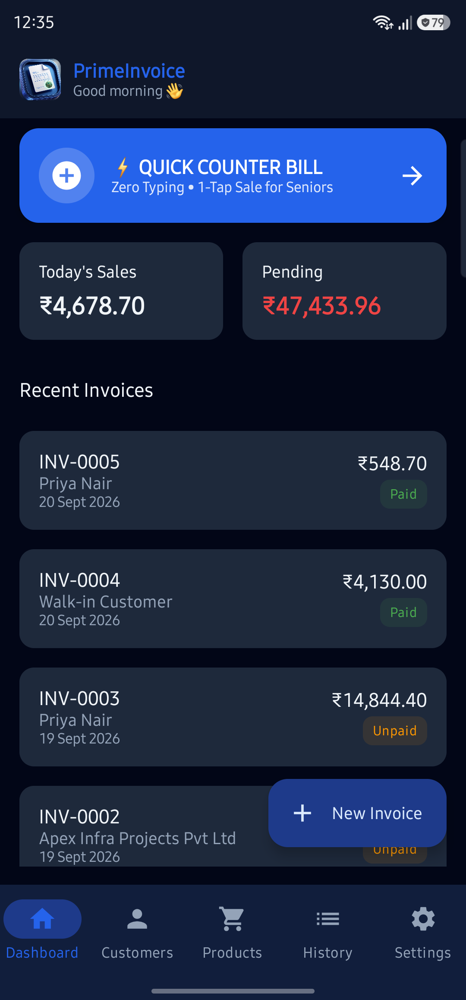
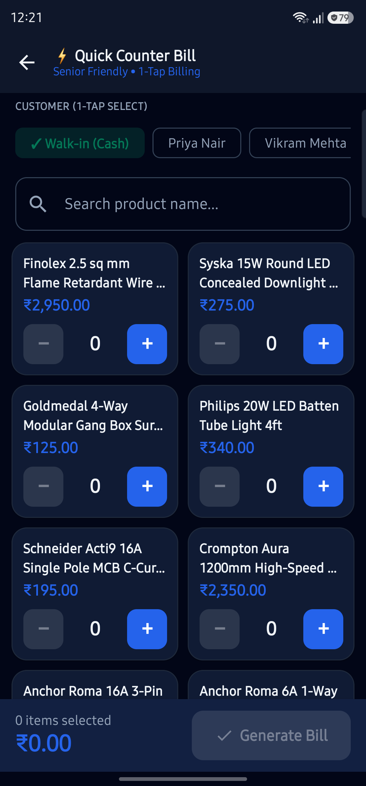
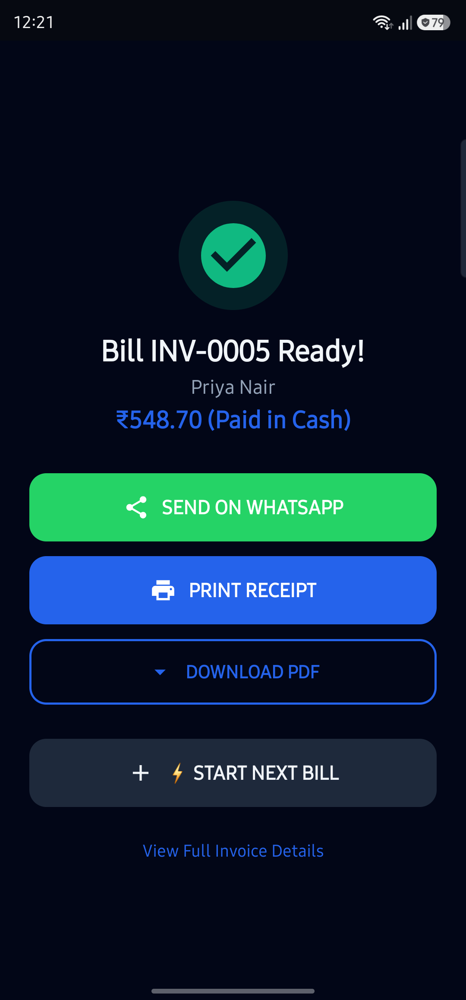
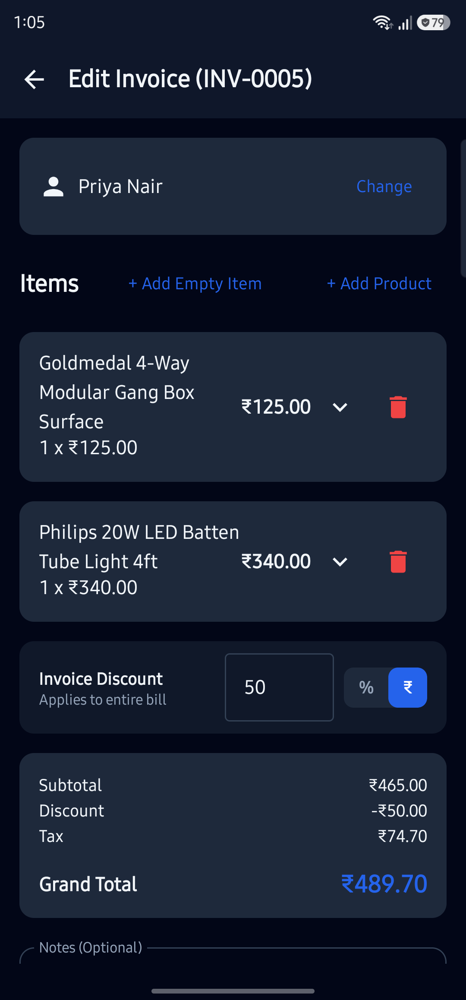
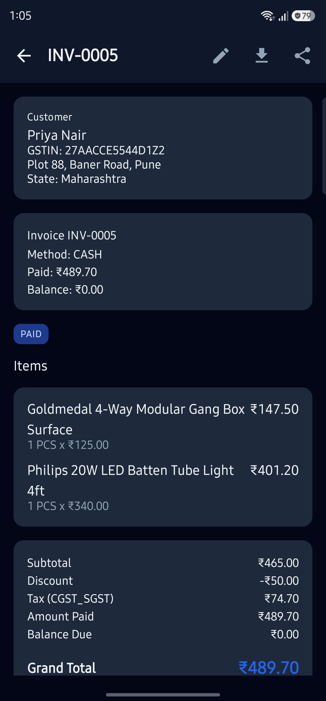
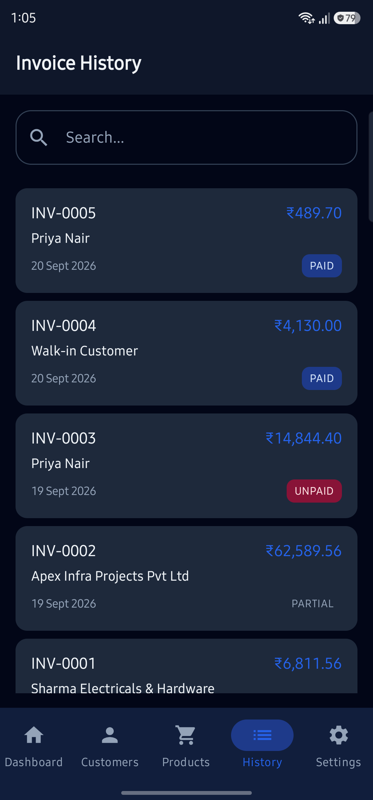
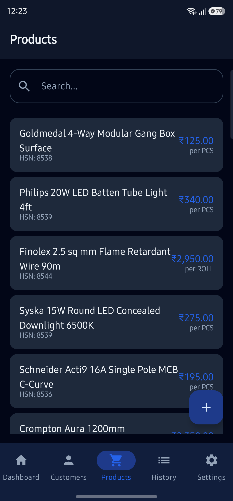
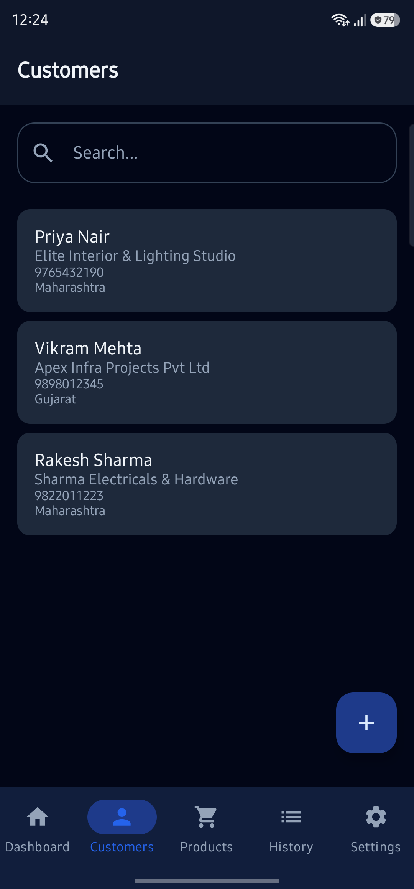

# Invoice Generator (PrimeInvoice)

[-3DDC84?style=flat&logo=android&logoColor=white)](https://android.com)
[](https://kotlinlang.org)
[-4285F4?style=flat&logo=jetpackcompose&logoColor=white)](https://developer.android.com/jetpack/compose)
[](https://developer.android.com/training/data-storage/room)
[](LICENSE)

A modern, offline-first, GST-compliant billing and invoice generation application built natively for Android. Designed for speed, extreme ease of use, and zero-typing counter sales—empowering retail shopkeepers, wholesalers, and elderly users to generate, print, and share invoices in seconds.

---

## Table of Contents

- [Core Features](#core-features)
- [Visual Walkthrough & Screenshots](#visual-walkthrough--screenshots)
- [How to Use the App (User Guide)](#how-to-use-the-app-user-guide)
  - [1. Generating a Quick Counter Bill (POS Mode)](#1-generating-a-quick-counter-bill-pos-mode)
  - [2. Creating a Standard GST Invoice](#2-creating-a-standard-gst-invoice)
  - [3. Editing an Invoice & Updating Discounts](#3-editing-an-invoice--updating-discounts)
  - [4. Printing & WhatsApp Sharing](#4-printing--whatsapp-sharing)
  - [5. Managing Products & Customers](#5-managing-products--customers)
- [GST Calculation & Compliance](#gst-calculation--compliance)
- [Architecture & Tech Stack](#architecture--tech-stack)
- [Setup & Build Instructions](#setup--build-instructions)

---

## Core Features

### ⚡ Senior-Friendly "Quick Counter Bill" (POS Mode)
- **Zero Typing Required**: Default customer is automatically set to `"Walk-in (Cash)"`.
- **1-Tap Customer Selection**: Top frequent customers appear as prominent quick chips.
- **Product Quantity Steppers**: Big `+` and `−` touch buttons to add/remove quantities without keyboard interaction.
- **Dynamic Product Ordering**: Frequently billed items automatically sort to the top.
- **Sticky Live Summary**: Real-time rolling total counter anchored to the bottom.

### 💰 Dual-Level Discount System
- **Overall Bill Discount**: Apply a flat rupee (`₹`) or percentage (`%`) discount across the entire invoice.
- **Item-Level Discounts**: Apply individual discounts per line item in `%` or `₹`.
- **GST-Compliant Proportional Apportionment**: Overall discounts are mathematically distributed across items proportional to taxable value to ensure exact CGST/SGST/IGST compliance.

### 📄 Advanced Invoicing & Invoice Editing
- **Complete Invoicing**: Supports custom item names, HSN/SAC codes, tax rates (0%, 5%, 12%, 18%, 28%), payment terms, and custom notes.
- **Invoice Update/Edit**: Seamlessly edit existing invoices—modify items, quantities, prices, and discounts with live recalculation and instant database sync.
- **Auto-Payment Tracking**: Track payment modes (Cash, UPI, Card, Bank Transfer) and statuses (`PAID`, `UNPAID`, `PARTIAL`).

### 🖨️ 1-Tap Wireless Printing & Instant Sharing
- **Direct Android Print Manager**: Print directly to any paired Bluetooth thermal receipt printer or Wi-Fi A4 printer with zero third-party drivers.
- **Instant WhatsApp Dispatch**: Automatically formats invoice details and attaches the generated PDF for 1-tap WhatsApp sharing.
- **Local PDF Archival**: High-resolution, professional tax invoice PDFs saved locally on device.

### 📱 Smooth Material 3 UX & Tactile Feedback
- **120Hz Fluid Transitions**: Smooth screen slides and cross-fades powered by `FastOutSlowInEasing`.
- **Rolling Odometer Numbers**: Animated total counters that slide up on increment and down on decrement.
- **Haptic Feedback**: Physical tactile vibrations on buttons and steppers for confident touch confirmation.

---

## Visual Walkthrough & Screenshots

| 1. Dashboard & Quick Access | 2. Quick Counter Bill (POS) |
| :---: | :---: |
|  |  |
| *Real-time revenue metrics & Quick Bill card* | *Customer chips & 1-tap quantity steppers* |

| 3. Bill Ready: Print & WhatsApp | 4. Advanced Invoice & Discount Editor |
| :---: | :---: |
|  |  |
| *1-Tap WhatsApp, Thermal/A4 Print, & Next Bill* | *Overall & item discounts with `%` / `₹` toggles* |

| 5. Invoice Detail & Breakdown | 6. Invoice History & Search |
| :---: | :---: |
|  |  |
| *Complete customer, tax breakdown, & payment info* | *Fast search and clean status badges* |

| 7. Product Catalog | 8. Customer Directory |
| :---: | :---: |
|  |  |
| *Stock, HSN codes, and price management* | *GSTIN, billing addresses, and contact ledger* |

---

## How to Use the App (User Guide)

### 1. Generating a Quick Counter Bill (POS Mode)
*Best for fast over-the-counter sales with zero keyboard typing.*

1. From the **Dashboard**, tap **`⚡ QUICK COUNTER BILL`**.
2. **Customer Selection**:
   - For regular walk-in cash sales, do nothing—`Walk-in (Cash)` is already selected by default!
   - For repeat customers, simply tap their name chip (e.g. `Priya Nair`).
3. **Add Products**:
   - Tap the `+` button on any product card in the 2-column grid.
   - Use `+` / `−` to adjust quantities.
   - Watch the sticky bottom bar update the live item count and grand total in real time.
4. **Generate & Complete**:
   - Tap the large blue **`Generate Bill`** button.
   - The success dialog pops up with 1-tap buttons:
     - 🟢 **SEND ON WHATSAPP**: Directly opens WhatsApp with the customer pre-filled and PDF attached.
     - 🔵 **PRINT RECEIPT**: Immediately triggers direct printing via Android Print Manager.
     - ⚡ **START NEXT BILL**: Resets the cart instantly for the next customer in line.

---

### 2. Creating a Standard GST Invoice
*Best for B2B transactions, custom item entries, or detailed terms.*

1. Tap **`+ New Invoice`** floating button from the Dashboard.
2. Select or search for a customer from the customer list.
3. Tap **`+ Add Product`** to pick from your catalog, or **`+ Add Empty Item`** for custom ad-hoc items.
4. Customize quantities, unit rates, and GST percentages (e.g., 0%, 5%, 12%, 18%, 28%).
5. Choose payment status (`PAID`, `UNPAID`, `PARTIAL`) and payment method (Cash, UPI, Bank Transfer).
6. Tap **`Generate Invoice`**.

---

### 3. Editing an Invoice & Updating Discounts
*Easily update existing invoices, change items, or adjust discounts.*

1. Go to the **History** tab from the bottom navigation.
2. Tap on the invoice you wish to modify.
3. In the top app bar, tap the **Pencil (Edit)** icon.
4. **Overall Invoice Discount**:
   - Scroll down to the **Invoice Discount** card.
   - Toggle between **`%`** (percentage) and **`₹`** (flat rupee amount).
   - Enter your discount value (e.g., `50` or `10`).
   - All subtotal, tax, and grand total numbers update live!
5. **Item-Level Discount**:
   - Tap the expand arrow (`v`) on any line item.
   - Toggle between **`%`** and **`₹`** next to `Disc`.
   - Enter the discount amount. The net price and `(-₹XX.XX)` indicator update immediately.
6. Tap **`Update Invoice`** at the bottom. The invoice and its generated PDF are automatically updated!

---

### 4. Printing & WhatsApp Sharing

- **From Quick Bill**: Tapping **`PRINT RECEIPT`** or **`SEND ON WHATSAPP`** operates with 1 tap.
- **From Invoice Detail**:
  - Tap the **Download / Print** icon in the top app bar to view or print the generated PDF.
  - Tap the **Share** icon to share via WhatsApp, Gmail, or any installed messaging app.

---

### 5. Managing Products & Customers

- **Products Tab**:
  - View full product catalog with selling prices and HSN codes.
  - Tap `+ Add Product` to enter new stock items with name, price, HSN, and default GST rate.
- **Customers Tab**:
  - View all registered B2B and B2C clients.
  - Add new clients with business name, contact phone, GSTIN number, and billing address.

---

## GST Calculation & Compliance

The app complies strictly with Indian Goods and Services Tax (GST) regulations:

1. **Tax Type Determination**:
   - **Intra-State (Same State)**: Tax is split equally into **CGST** and **SGST** (e.g., 18% $\rightarrow$ 9% CGST + 9% SGST).
   - **Inter-State (Different State)**: Tax is calculated as **IGST** (e.g., 18% $\rightarrow$ 18% IGST).

2. **Proportional Trade Discount Apportionment**:
   When an overall invoice discount is applied, it is apportioned across line items proportional to their taxable value before tax calculation:
   $$\text{Item Proportional Discount} = \text{Overall Discount} \times \frac{\text{Item Net Amount}}{\sum \text{Item Net Amounts}}$$
   $$\text{Item Taxable Value} = \text{Item Net Amount} - \text{Item Proportional Discount}$$
   $$\text{Item Tax} = \text{Item Taxable Value} \times \frac{\text{GST Rate}}{100}$$

---

## Architecture & Tech Stack

```text
app/
├── src/main/java/com/kjbilling/app/
│   ├── data/                 # Room Database, DAOs, Entities, and Repositories
│   ├── domain/               # Domain Models, InvoiceCalculator, and Formatters
│   ├── pdf/                  # Native Android PdfDocument & Print Helper
│   ├── navigation/           # Compose Navigation with smooth transitions
│   └── ui/                   # Jetpack Compose Screens, ViewModels, & Components
│       ├── dashboard/        # Dashboard with metrics & Quick Bill entry
│       ├── invoice/quick/    # Senior-Friendly Quick Counter Bill (POS)
│       ├── invoice/create/   # Standard Invoice Creator & Discount Editor
│       ├── invoice/detail/   # Invoice Details & Actions
│       ├── invoice/history/  # Invoice History & Search
│       ├── product/          # Product Catalog & Form
│       ├── customer/         # Customer Directory & Form
│       └── settings/         # Business Profile & Settings
└── src/test/                 # Unit Tests (Calculations, Discounts, POS logic)
```

- **Architecture**: MVVM with Clean Architecture principles.
- **Asynchronous Flow**: Kotlin Coroutines & `StateFlow` for reactive UI state.
- **Local Storage**: Android Room ORM backed by SQLite (100% offline).
- **UI Toolkit**: Jetpack Compose with Material 3 theming.

---

## Setup & Build Instructions

### Prerequisites
- Android Studio Ladybug (2024.2.1) or newer
- JDK 17
- Android SDK 35 (compileSdk 35, minSdk 26)

### Build and Run Tests
```bash
# Clone the repository
git clone git@github.com:sahil030804/invoice-generator.git
cd invoice-generator

# Run all unit tests (Calculator, Discounts, Quick Bill)
./gradlew testDebugUnitTest

# Build debug APK
./gradlew assembleDebug

# Install directly to connected device
./gradlew installDebug
```

---

## License

This project is open source and available under the [MIT License](LICENSE).
